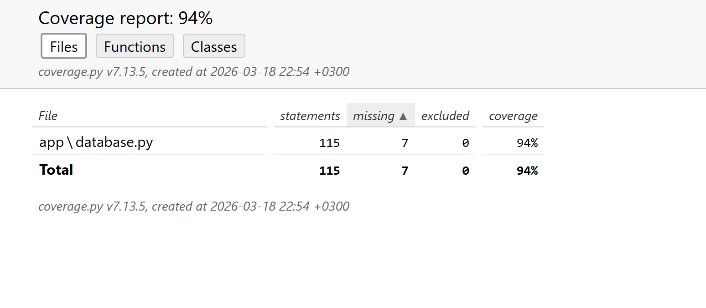
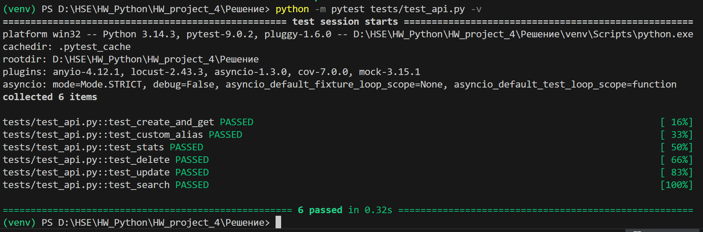
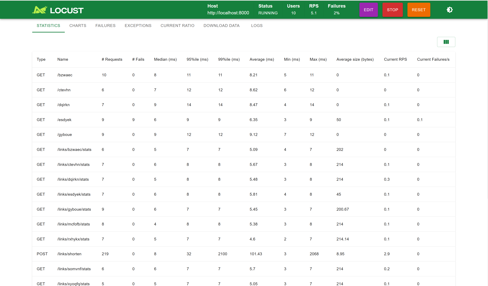
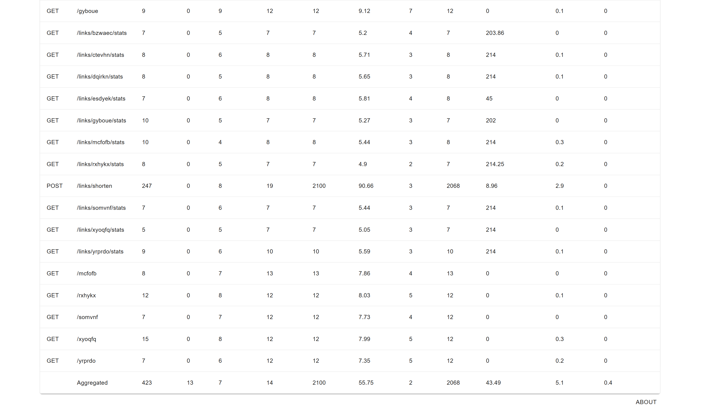

Результаты тестирования можно увидеть на скриншотах (в корне)

## Покрытие кода: 94%

## API тесты:

## locust

## Порядок проверки:
- psql -U postgres -c "CREATE DATABASE test_db;"
- pytest tests/ --cov=app --cov-report=html
- start htmlcov/index.html
- locust -f locustfile.py --host=http://localhost:8000